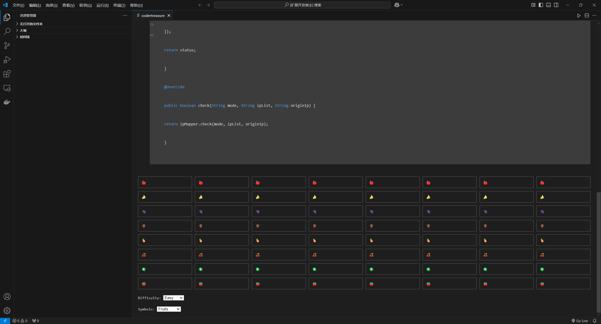

# CoderTreasure

A fun game extension for VSCode.
publisher qinhan

## Features
- Play a memory game (连连看) within VSCode.
- Hide the game from your boss with editor-style UI.

## Installation
1. Download the extension from the [VSCode Marketplace](https://marketplace.visualstudio.com/).
2. Install the extension in VSCode.

## Usage
1. Open the command palette (`Ctrl+Shift+P` or `Cmd+Shift+P`).
2. Type `Start Game` and select it to start the game.
3. Enjoy the game!

## Example
